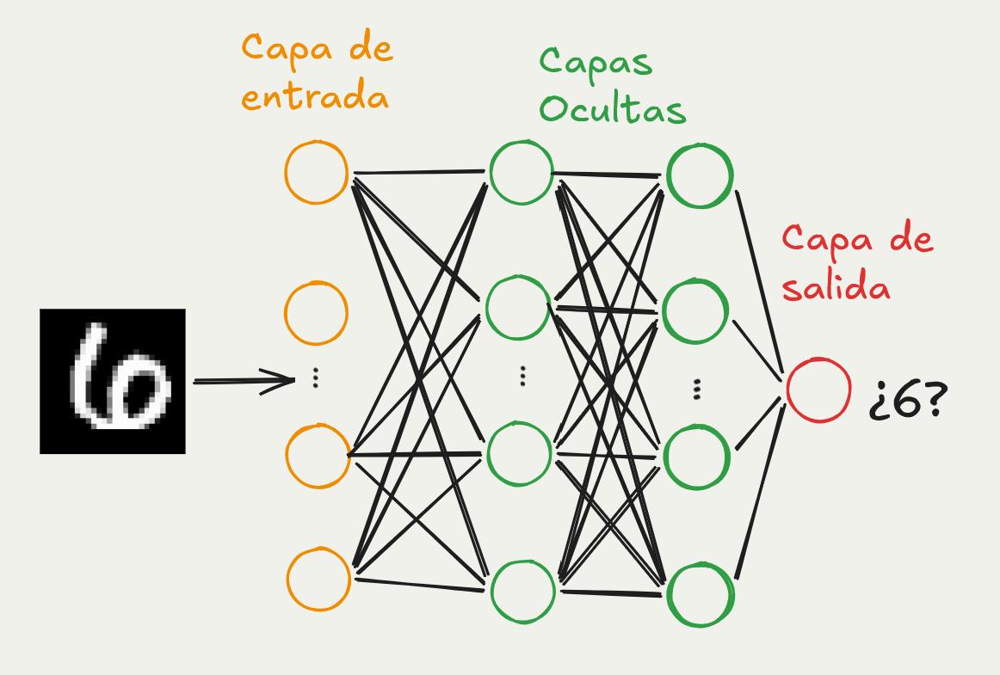
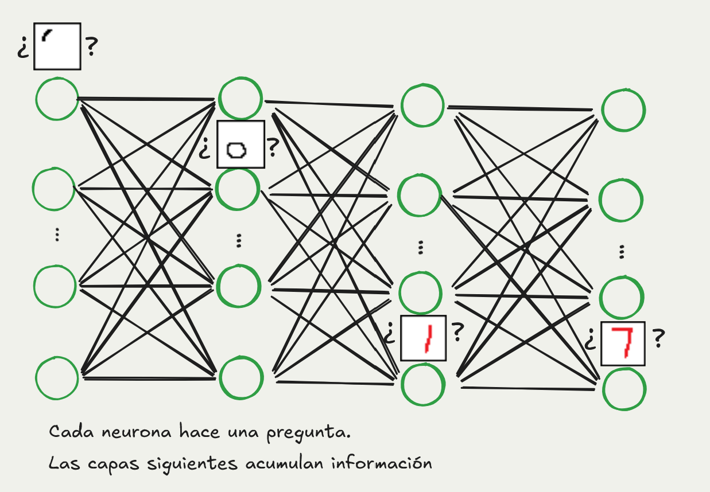
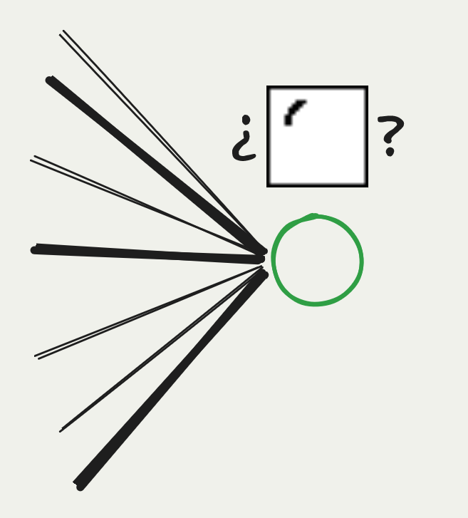
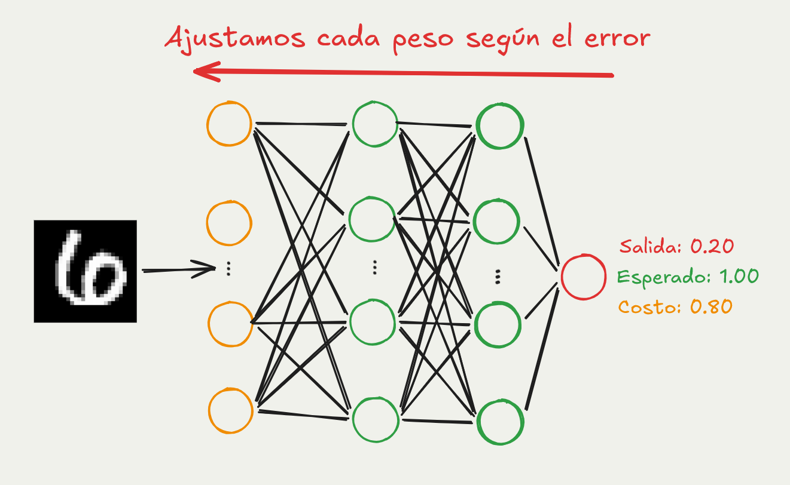
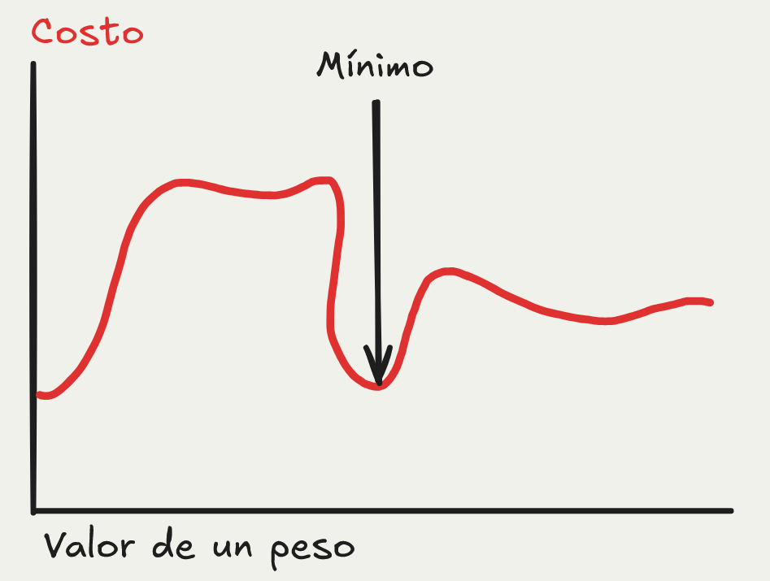
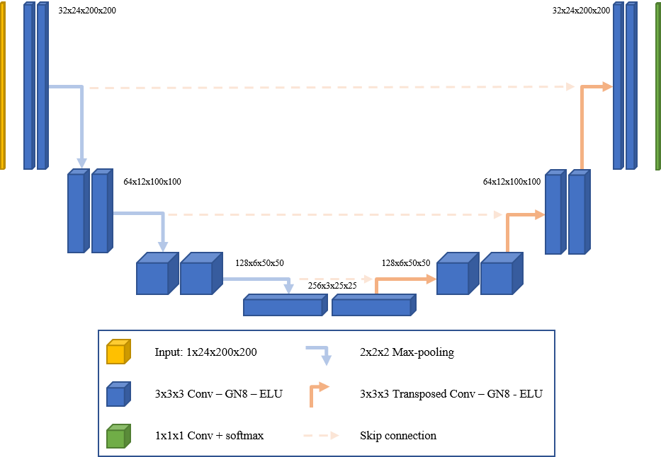
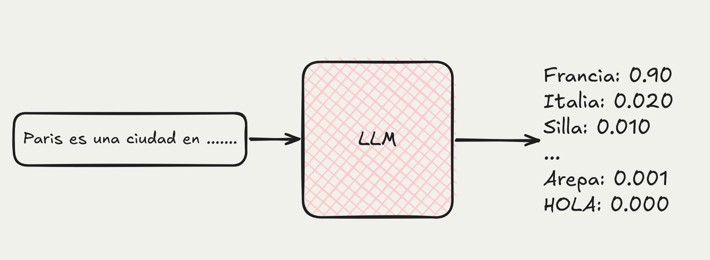
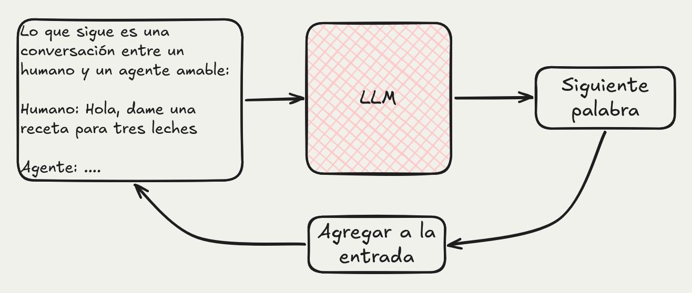
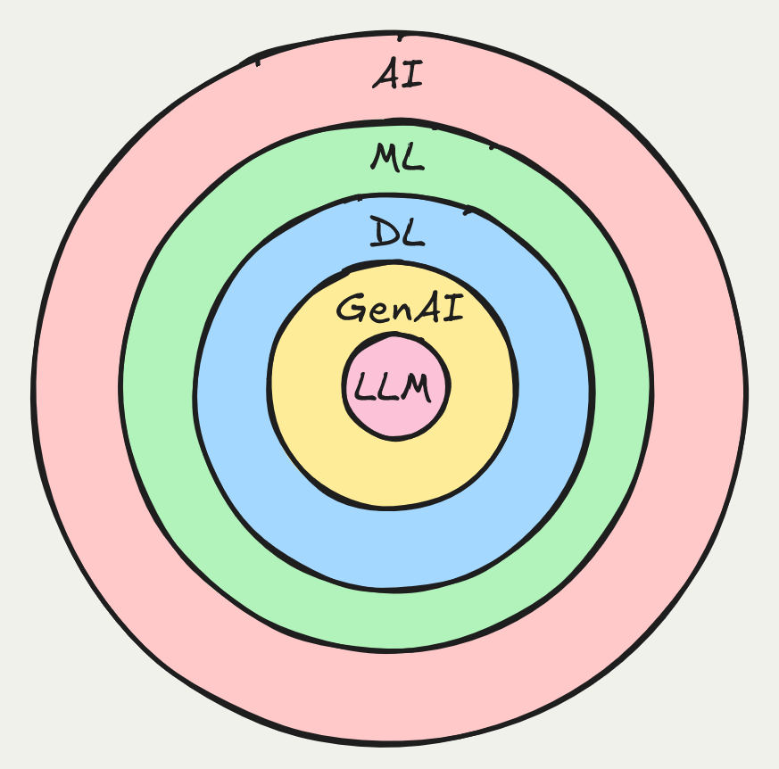

# Introducción a la Inteligencia Artificial

# ¿Qué es inteligencia?

::: {.r-fit-text}
¿Qué significa ser inteligente?
:::

## ¿Qué es Inteligencia Artificial?

> Un sistema artificial que realiza comportamientos que consideraríamos inteligentes si los realizara una persona.

::: {.fragment}
**La IA no es magia.**
:::

## Inteligencia artificial [es un concepto amplio]{.marker}

- En video juegos, la IA puede ser un conjunto de reglas que determinan el comportamiento de los enemigos. 

- En un sistema de recomendación, la IA puede ser un modelo que predice qué productos te interesan.

## ¿Cual de estas 2 imágenes es un perro?

¿Cual de estas imágenes es un 6?

::: {.center}
{width="100%"}
:::

# Describan un procedimiento para identificar un 6 en una imagen.
Discutamos.

## Aprendizaje Automático (ML): [Aprender de los datos]{.marker}

**El sistema aprende el comportamiento**

Obtenemos muchos ejemplos de un problema y el sistema encuentra patrones en los datos para poder resolverlo.
```{dot}
//| echo: false
//| fig-width: 8
//| fig-height: 3
//| out.width: 50%
digraph {
  graph [rankdir=LR, bgcolor="transparent"]
  node [shape=box, style="rounded"]
  datos [label="Datos"]
  entrenamiento [label="Entrenamiento"]
  modelo [label="Modelo aprendido"]

  datos -> entrenamiento -> modelo
}
```

## ¿Qué es un modelo?

:::{.columns}
::: {.column width="70%"}
Así como un carro modelo es una versión pequeña de un vehículo real, 

[un modelo de ML es una versión simplificada de un sistema]{.marker}, que permite simular su comportamiento y hacer predicciones sobre él.
:::
::: {.column width="30%"}

:::
:::

## ¿Qué es una red neuronal?

{fig-align="center"}

## ¿Qué es una red neuronal (NN)?

- Modelo de ML inspirado en el cerebro humano.
- Compuesta por capas de nodos (neuronas) que procesan información.

## ¿Qué es una neurona?

- Unidad básica de una red neuronal.
- Almacena un número entre 0 y 1 que representa su activación.

```{dot}
//| echo: false
//| fig-width: 8
//| fig-height: 3
digraph {
  graph [rankdir=TD, bgcolor="transparent"]
  node [shape=circle, style="rounded"]
  neurona_001 [label="0.01", style="filled", fillcolor="#101010" fontcolor=white]
  neurona_025 [label="0.25", style="filled", fillcolor="#3d3d3d" fontcolor=white]
  neurona_050 [label="0.50", style="filled", fillcolor="#7a7a7a" fontcolor=white]
  neurona_075 [label="0.75", style="filled", fillcolor="#d0d0d0"]
  neurona_099 [label="0.99", style="filled", fillcolor="#f0f0f0",]

  neurona_001
  neurona_025
  neurona_050
  neurona_075
  neurona_099
}
```

## ¿Cómo representamos los números como neuronas?

](assets/mnist_pixels.png){fig-align="center"}

## ¿Cómo representamos los números como neuronas?

- Cada pixel de la imagen se convierte en una neurona con un valor entre 0 y 1, donde 0 es negro y 1 es blanco.
- Para nuestro ejemplo de 28x28 pixeles, necesitamos 784 neuronas para representar la imagen completa.

## ¿Qué hacen las capas ocultas?

{fig-align="center"}

## ¿Cómo "pregunta" una neurona?

::: {.columns}
::: {.column width="50%" style="font-size: 80%;"}
- Cada neurona recibe información de las neuronas de la capa anterior.
- Cada conexión tiene un peso que indica la importancia de esa conexión.
- Entrenar la red neuronal significa ajustar los pesos de las conexiones para que la red haga buenas predicciones.
:::
::: {.column width="50%"}

:::
:::


## Backpropagation: Entrenar una red neuronal

{fig-align="center"}

## Backpropagation: función de costo

{fig-align="center"}

## ¿Por qué son tan poderosas las redes neuronales?

- Pueden aproximar cualquier función (Teorema de aproximación universal).
- Capaces de aprender representaciones jerárquicas: pueden combinar características simples para formar representaciones más complejas.
- Escalables: se vuelven más inteligentes a medida que se les da más datos y más capacidad de cómputo.

## ¿Qué es Deep Learning (DL)?

- Subcampo de ML que utiliza redes neuronales profundas (con muchas capas) para modelar problemas.

{fig-align="center"}

# ¿Qué es un gran modelo de lenguaje (LLM)?
Eg: GPT, Gemini, Claude

# ¿Cuál es la entrada de un (LLM)?

:::{.fragment}
Texto, imágenes, audio, video, etc.
:::

# ¿Cuál es la salida de un (LLM)?
:::{.fragment}
La siguiente palabra más probable
:::

## Gran modelo de lenguaje (LLM)

### Tres tristes tigres tragaban...
:::{.fragment}
- ...trigo
:::
:::{.fragment}
- ...carne
:::
:::{.fragment}
- ...arepas
:::
:::{.fragment}
- ...pescado
:::

## LLM

Un modelo de ML entrenado con grandes cantidades de texto para predecir la siguiente palabra más probable en una secuencia.

:::{style="font-size: 80%;"}
Técnicamente, una LLM le asigna una probabilidad a cada palabra en su vocabulario dado un contexto de palabras anteriores.
:::

## LLM

{fig-align="center"}

## ¿Cómo conversamos con un LLM?

{fig-align="center"}


## ¿Dónde encaja cada término?

{fig-align="center"}

# ¡Gracias!


